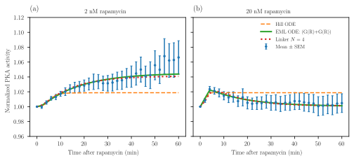
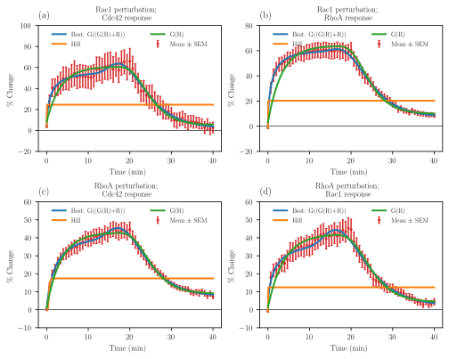
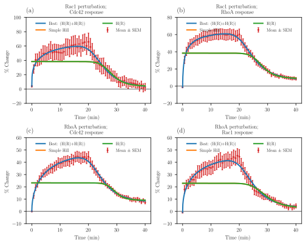
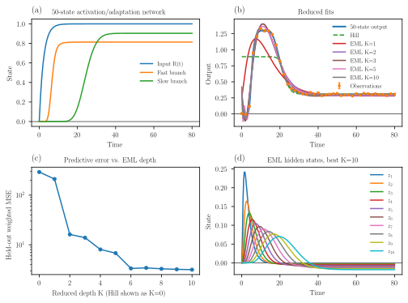

# 生物学的ダイナミクスの簡略化モデルに向けた、EML演算子による非単調応答モジュールとカスケード
*(Non-Monotone Response Modules and Cascades from the EML Operator for Reduced Models of Biological Dynamics)*

**著者**: Amir Erez¹,*
**所属**: ¹ ラカ物理学研究所、エルサレム・ヘブライ大学、エルサレム 9190401、イスラエル
**(日付: 2026年5月6日)**

## 概要 (Abstract)
ヒル関数のような標準的な飽和応答関数は単調（monotone）であるため、単一のブロックで動員（recruitment）によって引き起こされるオーバーシュートや適応的な過渡応答を表現することができません。このような非単調な応答を飽和型の基本要素から再現するには、少なくとも相反する振幅を持つ2つのブロックの差分を取る必要があり、静的ブロックのパラメータ数が倍増してしまいます。

本研究では、「単一の二項演算子であるEMLがすべての標準的な初等関数を生成できる」という最近の数学的結果に基づき、EMLを簡略化された非線形常微分方程式（ODE）の構造化された文法として使用します。これにより、オーバーシュートを直接捉えることができる活性化-抑制（activation-suppression）モジュールが得られます。

私たちはこのフレームワークを3つの設定で検証しました。
第一に、PKA-R 再局在化データにおいて、EML文法は確立されたメカニズム生物学と一致する簡略化された代替モデル（サロゲート）を発見しました。
第二に、Rho-GTPase 動員データにおいて、EML表現木に対する網羅的な探索により、4つのすべての摂動-応答データにおいて共通する構成形式が選択されました。
第三に、50状態のシミュレーションネットワークは、固定の時間的基底として機能するEMLカスケードによって圧縮されました。

このようにして、生物学的ダイナミクスの簡略化モデルに対するEMLの強力な表現力と可能性を実証します。

## I. 導入 (INTRODUCTION)

微分方程式は、物理学や定量生物学の多くの分野で中心的な位置を占めています。これらは、観察された振る舞いを構成する少数の状態変数、結合、および時間スケールを特定するのに役立ちます[1, 2]。しかし、生物学のモデリングにおいては、この簡略化（次元削減）はしばしば非常に近似的なものになります。摂動実験では、オーバーシュート、適応、遅延抑制、または二相性の依存性が明らかになることがありますが、その背後にある生化学的ネットワークは部分的にしか判明していないことがよくあります。そのような場合、ヒル型飽和のような標準的な応答関数[3]に頼るか、あるいはパラメータの特定が困難な大規模なメカニズムモデルに頼ることが多くなります。ここでは、固定された現象論的曲線よりも表現力が豊かでありながら、任意の曲線フィッティングよりも制約が強い、低次元の非線形常微分方程式（ODE）を生成するための制御された方法を探求します。

シンボリック回帰（記号回帰）はこれに関連する問題に対処するものです。つまり、データが与えられたとき、それを説明する解析式を探索します。現代のアプローチでは、探索が適切な帰納的バイアスによって制約されていれば、数値データから科学的法則やコンパクトな物理的関係を復元できることがあると示されています[4–6]。非線形ダイナミクスのスパース同定を含む動的な変法も同様に、時系列データからコンパクトな支配方程式を求めます[7–9]。これらの手法の根底にあるのは、「モデル探索は、探索文法、モデルの複雑さに対するペナルティ、および検証基準が事前に指定されている場合により有意義になる」という有用な原則です。そうでなければ、十分に表現力のあるシンボルシステムは、過学習のための言語になってしまいます。

ここでは、Odrzywolek [10] によって最近提案された EML 演算子に基づく、簡略化された非線形ダイナミクスのための新しい文法を探求します。この単一の二項演算子
$$ \text{eml}(x, y) = \exp(x) - \ln(y) \quad (1) $$
は、定数 1 と組み合わせることで、初等関数の標準的なレパートリーを生成することができます。Odrzywolek の研究における主要なポイントは「構文の普遍性（syntactic universality）」です。つまり、初等式は EML 演算子を内部ノードとする二分木として表現できます。したがって、シンボリック回帰のための自然な文法が浮かび上がります。累乗、指数、対数、算術演算など、ばらばらな多数の基本要素を探索する代わりに、EMLで生成された表現木（これは通常の数学的形式に簡単に翻訳可能）を探索すればよいのです。

強調しておきたいのは、EMLは新しい物理的または生物学的な相互作用法則ではないということです。普遍的な表現文法が提供するのは「構文」であり「意味」ではありません。物理的または生物学的な解釈は、文法が制限され、結果として得られたモデルがより単純な帰無モデルや、可能であればメカニズムの代替案と比較された後にのみ入ってきます。本稿では、EMLは候補となる方程式の生成器として使用されます。選択された方程式は、活性化、緩和、および隠れた粗視化状態の項を持つ通常の方程式と同様に読み解かれます。

私たちは、シンプルでありながら有用なEML生成モジュールを定義します：
$$ M_1(R) = \text{eml}(\alpha \ln R, e^{\beta R}) = R^\alpha - \beta R \quad (2) $$
この式は、適応的または二相性の応答に対する最小の候補となります。すなわち、入力が増加すると最初は出力が増加しますが、入力が十分に強くなると出力が抑制されます。展開された形式で書けば、EML記法そのものよりも容易に解釈できます。EMLの役割は、このモジュールやより高次のモジュールが生成される「構成規則」を提供することです。

よく知られているヒル関数は、単調な飽和応答に対する適切な帰無モデルであり続けます[11]。これらは解釈可能であり、生物系をモデリングする際に広く使用されています。EML生成モジュールは、これらが機能している場合にはそれを置き換えようとはしません。その目的は、観察された応答が非単調であったり、適応的であったり、競合する正負のプロセスによって形成されている場合[12]に、代替案を提供することです。そのような場合、単調な応答関数では不十分ですが、私たちのEMLモジュール（式2）は少数のパラメータで内部の最適値をサポートします。

私たちの中心的な主張は方法論的なものです。EMLゲートはその引数に対して非単調であり、3つのパラメータを持つため、単調な入力の下で「上昇してから下降する」応答を作り出せる最小の「活性化-抑制」ブロックとなります。標準的な飽和の基本要素（例えばヒル関数）は単調であり、同じ形状を作り出すには少なくともそのようなブロック2つの差を取る必要があります。この「深さ1」における構造的な非対称性に基づいて、私たちはEMLを、簡略化された非線形ODEを構築するためのコンパクトで微分可能、かつ再帰的に拡張可能な文法として使用します。深さ1では、EMLは活性化-抑制の応答関数を生成し、より深い深さでは、逐次的な畳み込み積分によって解が与えられる「隠れ状態のカスケード」を生成します。私たちは、EMLの深さを増やし、その追加された構造がホールドアウトされた（検証用の）予測誤差によって正当化されるかどうかを問うことができる、制御されたモデルの階層を導き出します。重要なのは、EMLの深さは分子ステップの数（カウント）ではないということです。それは、隠れた遅延や適応プロセスが測定された応答を形成する際に有用な、効果的な「粗視化された動的深さ（coarse-grained dynamical depth）」なのです。

本稿では、この方法論を3つのステップで展開します。第一に、LaCroixら[13]のPKA調節サブユニット再局在化データにEML-ODE文法を適用します。彼らは観察された時系列データに対して、メカニズムに基づいたリンカー占有モデルを測定し提案しました。したがって、ここでのEML文法は、既知のメカニズムを「置き換える」ためではなく、代替モデル（サロゲート）としてテストされます。第二に、Nandaら[14]のRho-GTPase摂動データに制約された文法を適用し、同じ構成的深さを持つヒル関数文法の探索結果と直接比較することで、2つの文法間の「深さ1」の非対称性を具体的に示します。第三に、おもちゃ（toy）の高次元の活性化-適応ネットワークを構築し、低次元のEMLカスケードがその振る舞いを捉えることができるかどうかを問います。

## II. 結果 (RESULTS)

私たちは、活性化-抑制モジュール（式2）から始めます。対象となるシステムに応じて、抑制項は隔離（sequestration）、適応（adaptation）、毒性（toxicity）、または正の第1項に対抗するその他のプロセスを表す可能性があります。$0 < \alpha < 1$ かつ $\beta > 0$ の場合、$M_1(R)$ は単峰性（unimodal）となります。最適な入力は $R_* = (\alpha/\beta)^{1/(1-\alpha)}$ であり、これは Appendix A で導出されます。したがって、単調に増加する入力がこの最適点を通過する場合、一時的なオーバーシュートを生じさせる可能性があります。この特徴が、EML活性化-抑制モジュールを、単調なヒル関数の応答と区別する点です。ヒル関数は、上昇して飽和する、または下降して飽和することはできますが、第2の項を追加しない限り、単調な入力の下で「上昇してから下降する」ことはできません。最小の時間依存応答モデルは、以下の1次緩和方程式（first-order relaxation equation）です。
$$ \tau \dot{y} = -y + y_0 + B M_1(R(t)) $$
$$ \qquad \quad = -y + y_0 + B [R(t)^\alpha - \beta R(t)] \quad (3) $$

化学的に誘導される動員（recruitment）実験において、有用な入力モデルは以下の通りです。
$$ R(t) = R_\infty (1 - e^{-k_R t}) \quad (4) $$
ここで、$R_\infty$ は加えられた摂動の強さに比例します。式(3)と式(4)は、最小の活性化-抑制ODEを定義します。これは以下の畳み込み積分解（convolution solution）を持ちます（Appendix B）。
$$ y(t) = y(0)e^{-t/\tau} + \frac{1}{\tau} \int_0^t e^{-(t-s)/\tau} [y_0 + B M_1(R(s))] ds \quad (5) $$

### A. シンボリック回帰の文法としての EML (EML as a symbolic-regression grammar)

前述の方程式は、明示的な簡略化モデルとして読むことも、あるいは私たちが提案する方法論を定義する「制約された EML 表現文法」の「深さ1（depth-one）」のメンバーとして読むこともできます。以下では、$R(t)$、二項の和、そして「中央揃えされたEMLゲート（centered EML gate）」から候補モデルを生成します。
$$ G_{a,b,c}(x) = \text{eml}(a \ln[c+x], e^{bx}) - c^a = (c+x)^a - bx - c^a \quad (6) $$
ここでの引き算は、入力がゼロのときにゲートをゼロに合わせる（中央揃えする）ためのものであり、新しいメカニズムではありません。これは生成される表現のベースラインを固定するものです。この制約された文法はコンパクトに次のように指定されます。
$$ E ::= R \mid G(E) \mid E + E \quad (7) $$
慣れていない読者のために説明すると、記号 $E$ は候補となる表現（expression）を表し、「$::=$」は「〜として生成される」と読みます。また、縦棒「$\mid$」は「または」を意味します。したがって、式(7)は、候補表現 $E$ が「入力変数 $R$ 自身」「以前に生成された表現にEMLゲートを適用したもの $G(E)$」「以前に生成された2つの表現の和 $E + E$」の3つのいずれかになる可能性があることを示しています。例えば、この文法は最初に $R$ を許可します。2番目のルールを適用すると $G(R)$ が得られます。それをもう一度適用すると $G(G(R))$ になります。加算ルールを使えば $G(R) + R$ や $G(R) + G(R)$ などの式が得られます。和に対してゲートを適用すれば $G(G(R) + R)$ のような式も生成されます。これらが、フィッティングされ比較される表現木（expression trees）です。重複を避けるため、$G(R) + R$ と $R + G(R)$ は同じ表現として扱われます。フィッティングされた静的応答、すなわち固有の緩和時間を持たない瞬間的な代数的マッピングは、以下の形をとります。
$$ y(t) = y_0 + B E(R(t; k)), \quad R(t; k) = 1 - e^{-kt} \quad (8) $$

次に探索アルゴリズムは、指定された「深さ」および「ノード数」の制限を満たすすべての表現を列挙し、トレーニング用時系列データ上で非線形最小二乗法を用いてそれらの連続パラメータをフィッティングし、ホールドアウトされた（検証用の）重み付き誤差に加えて、表現の深さとノード数に対する任意のペナルティを用いてモデルをランク付けします。標準誤差 $\sigma_i$ を持つ観測値 $y_i$、トレーニングセット $\mathcal{T}$、およびホールドアウトセット $\mathcal{V}$ に対して、フィッティングされるパラメータは以下のようになります。
$$ \hat{\theta}_E = \arg\min_{\theta} \sum_{i \in \mathcal{T}} \left[ \frac{y_i - \hat{y}_E(t_i; \theta)}{\tilde{\sigma}_i} \right]^2 \quad (9) $$
ここで $\tilde{\sigma}_i = \max(\sigma_i, \sigma_{\text{floor}})$ は、ゼロまたは非常に小さな誤差値がフィッティングを支配するのを防ぎます。モデルのランク付けには次式を使用します。
$$ \mathcal{S}(E) = \frac{1}{|\mathcal{V}|} \sum_{i \in \mathcal{V}} \left[ \frac{y_i - \hat{y}_E(t_i; \hat{\theta}_E)}{\tilde{\sigma}_i} \right]^2 + \lambda_d d(E) + \lambda_n n(E) \quad (10) $$
ここで $d(E)$ はEMLの深さ、$n(E)$ は表現木のノード数です。ここに示すフィッティングでは $\lambda_d = \lambda_n = 0$ とし、ペナルティなしのホールドアウト重み付き平均二乗誤差を報告します。また、診断指標としてAICとBICも計算しますが、これらは主要な選択基準ではありません。モデルの比較方法は他にもありますが、私たちの方法論的目的は、正確な比較の枠組みに依存するものではありません。EMLは生物学的な時系列データの「説明（理由）」ではありません。それはコンパクトな方程式を提案するために使用される「エンジン」なのです。したがって、以下の経験的な例は、EMLが物理的な相互作用法則であるという主張ではなく、「制約付きモデル探索フレームワーク」のデモンストレーションとして読まれるべきです。

自然な比較対象となるのは、以下のヒル動員応答（Hill recruitment response）です。
$$ H(R) = A \frac{R^h}{K_d^h + R^h} \quad (11) $$
これに対応する緩和モデルは次のようになります。
$$ \tau \dot{y} = -y + y_0 + H(R(t)) \quad (12) $$
式(12)は、摂動が飽和活性に対する単調な接近を生み出す場合には、正しい帰無モデルとなります。しかしながら、動員によって引き起こされるオーバーシュートや二相性の応答に対しては構造的に不適切です。なぜなら、$H(R)$ は $h > 0, K_d > 0$ のあらゆる選択において $R$ に対して単調だからです。したがって、飽和型の基本要素から「上昇してから下降する」応答を再現するには、相反する振幅を持つ少なくとも2つのそのようなブロックの差分が必要となり、静的パラメータの数が倍増してしまいます。対照的に、式(6)の中央揃えされたEMLゲートは $0 < a < 1, b > 0$ において $x$ に対して非単調であり、単一のブロックで活性化-抑制の応答を作り出します。この「単一ブロックにおける非単調性」こそが、以下の実験例で活用される構造的な非対称性であり、Nandaらのデータで同じ構成的深さを持つヒル文法とEML文法を比較する際（セクション II C）に、再びこの点に明示的に触れます。

### B. LaCroixらにおけるPKA-R再局在化 (PKA-R relocalization in LaCroix et al.)

最初の例は、LaCroixら[13]によるPKA調節サブユニット（PKA-R）の再局在化実験です。ここでは、ラパマイシンによって誘導されたPKA-Rの細胞膜への動員が逆説的な応答を生み出します。すなわち、低または中程度のPKA-R動員は細胞膜におけるPKA活性を促進しますが、高い動員はそれを抑制します。著者らはこれをリンカーまたは足場（scaffold）のような化学量論的効果として解釈しています。中程度の存在量では、PKA-Rは生産的な局所シグナル伝達複合体の組み立てを助けますが、過剰に存在すると、cAMPやPKA触媒サブユニット（PKA-C）を生産的な複合体から引き離し（titrate away）、活性を抑制してしまいます。

このデータセットは、シグナル伝達が「完全に占有されたリンカー分子の濃度」に比例するという独立して動機付けられたメカニズム[13]を持っているため有用です。そのモデルの力学的バージョンは次のように書くことができます。
$$ \tau \dot{y}_D = -y_D + 1 + A [\Phi_N(S_D(t)) - \Phi_N(S_0)] \quad (13) $$
ここで、$S_D(t) = S_0 + qD(1 - e^{-k_R t})$ であり、$\Phi_N(S)$ は完全に占有されたリンカー濃度（スケールファクター込み）を表します。4つのcAMP結合部位に関連する $N = 4$ のケースでは、
$$ \Phi_4(S) = \frac{S}{S^4 + S^3 + 2S^2 + 3S + 4} \quad (14) $$
となります。式(14)の導出と正規化は Appendix D にまとめられています。

私たちはこの例を用いて、制約されたEML文法が簡略化された代替モデル（サロゲート）を見つけられるかどうかをテストしました。探索には式(7)と同じ表現文法を使用しましたが、選択された表現を瞬間的な静的応答としてフィッティングするのではなく、1次反応式に埋め込みました。
$$ \tau \dot{y}_D = -y_D + 1 + B E(R_D(t; k)), \quad R_D(t; k) = D(1 - e^{-kt}) \quad (15) $$
このキネティックな（力学的な）埋め込みは重要です。純粋な静的文法 $y_D(t) = 1 + B E(R_D(t))$ は、PKA活性が動員に瞬時に従うことを強制するため、人工的で早すぎる特徴を生み出す可能性があります。式(15)の緩和形式（relaxation form）はそのアーティファクトを取り除き、文法に対してヒル関数やリンカーモデルの比較対象と同じ「最小限のキネティック構造」を与えます。

Figure 1は、結果として得られた2用量（two-dose）のフィッティングを示しています。ヒルODEは、用量依存的な単調なプラトーに近づくため、構造的に限界があります。そのため、持続的な低用量応答と過渡的な高用量応答の共存を捉え損ねています。リンカーモデルは、予想通り優れたメカニズム的説明を提供しています。制約付き探索から選択された最適なEML文法ODEは次の通りでした。
$$ E_*(R) = G_1(R) + G_2(R) \quad (16) $$
または、明示的に書くと以下のようになります。
$$ E_*(R) = (c_1 + R)^{a_1} - b_1 R - c_1^{a_1} + (c_2 + R)^{a_2} - b_2 R - c_2^{a_2} \quad (17) $$
このようにして、文法は同じ動員変数を共有する「2つの中央揃えされた1ゲートの活性化-抑制コンポーネントの和」を選択しました。この数値的な優劣（エラーの小ささ）を過大評価すべきではありません。EML表現はリンカーモデルよりもフィッティングされるパラメータが多く、依然としてリンカーモデルの方がメカニズム的により好ましい説明だからです。重要な点は、制約されたEML文法が既知の活性化-抑制のモデリングと適合（互換）しており、ヒル関数の帰無モデルよりも明らかに改善されているということです。

### C. 未解明なダイナミクスに対する文法探索 (Grammar search on unresolved dynamics)

2番目の例では、NandaらによるRho-GTPaseの動員実験を使用します。この実験では、恒常的活性型のRhoファミリーGTPaseが細胞膜へ急激に動員され、下流の活性センサーが経時的に追跡されました[14]。前の例とは異なり、このデータにはLaCroixのリンカー方程式に相当するようなコンパクトなモデルが伴っていません。したがって、このデータは「簡略化された方程式を提案し選択するための文法としてのEML」という方法論的な主張をテストするのにより適しています。

私たちは、式(7)の制約された文法を、RhoAおよびRac1における摂動とその結果生じる応答トレースに適用しました。探索空間は小さく制限され、表現はEMLの深さ3まで、表現木の総ノード数5まで列挙され、連続パラメータはトレーニング用時点データでフィッティングされました。候補モデルは、ホールドアウトされた（検証用の）時点データにおける重み付き誤差によってランク付けされました（Fig. 2）。この探索における2つの特徴は注目に値します。第一に、深さ1であってもEML表現 $G(R)$（各パネルの緑色の曲線）はすでに非単調であり、データの「上昇してから下降する」動きを定性的に追跡しています。これは、飽和してしまうヒル関数の比較対象（オレンジ色の曲線）とは対照的です。単一のヒル関数ブロックは、単調な動員入力の下で上昇してから下降することはできませんが、単一の中央揃えされたEMLゲートはそれが可能です。第二に、同じ「深さ2」の表現 $G(G(R)+R)$ が、4つのすべての応答トレースに対して最適なホールドアウトモデルとして選択されました。このアルゴリズムは、単に手動で選んだヒル曲線と手動で選んだEML曲線を比較したわけではありません。小さなEML表現空間を探索し、4つの物理的に異なる摂動-応答の組み合わせすべてにおいて、同じ分岐表現が勝利したのです。私たちはこれを微視的なメカニズムとは解釈しませんが、「入力と『遅延して飽和した入力』を組み合わせ、その後抑制される」という共通の構成的モチーフが、これらの応答の支配的な時間的構造を捉えていることを示唆しています。

ヒル型のモデリングと公平に比較するために、私たちは平行して「ヒル関数文法」の探索も行いました。ここでは、EMLゲートを同じ形式のヒルブロックで置き換え、$E ::= R \mid H(E) \mid E+E$ とし（$H(\cdot)$ は式(11)で与えられる）、キネティックな埋め込み、探索の境界、およびホールドアウト検証は全く同じにしました。結果は Fig. 3 に示されています。深さ1において、$H(R)$ は予想通り4つのすべてのパネルで単調な飽和曲線を生成し、後半の減衰を捉えることに明らかに失敗しています。深さ $\le 3$ における最適なヒル文法表現は、4つのすべてのパネルで $(H(R) + H(R))$ となり、Fig. 2 の EML フィットと非常によく一致します。したがって、定性的な図式は次のようになります：深さ1では、EML文法のみが非単調な応答を生成する。深さ2では、（相反する振幅を持つ）2つのヒル関数の和[12]がEMLのフィットを再現する。EML文法は独自の表現力を持つわけではありませんが、「深さ2」のヒル構造を、静的ブロックのパラメータ数がより少ない「深さ1」の表現へと圧縮（collapse）するのです。

この非対称性は、AICおよびBICを使用して定量化できます（Appendix C の Table S3）。深さ1では、すべてのパネルにおいて EML ゲート $G(R)$ がヒルブロック $H(R)$ よりも非常に大きな差（$\Delta$AICは277〜373、$\Delta$BICは275〜370）で好まれました。これは、単一の飽和ブロックでは「上昇してから下降する」形状に適合できないことを反映しています。深さ2になると比較の差は縮まります。EML表現 $G(G(R)+R)$（パラメータ数 $p = 9$）は、ヒル関数の和 $(H(R) + H(R))$（$p = 8$、速度定数を共有）よりも1つ多くのパラメータを持っているにもかかわらず、パネル (a), (c), (d) において最小のAICとBICを達成しました（$\Delta$AICはそれぞれ27、5.0、10.0）。パネル (b) では、ホールドアウトされたwMSEにおいて2つの文法は本質的に区別がつかず（0.0698 vs. 0.0737）、BICのパラメータ節約の好みがよりシンプルなヒル関数を選択しました。したがって、両方の情報量基準は、Fig. 2 と Fig. 3 の曲線が視覚的に示唆していることを確認しています。すなわち、深さ2においては2つの文法はフィットの質という点では互換性（interchangeable）があり、EMLが選択される理由は主に、浅い深さでのパラメータの節約（parsimony）と、各ブロックが単一の活性化-抑制ユニットとして解釈可能であることに正当化されるのです。

### D. おもちゃの粗視化ベンチマーク (A toy coarse-graining benchmark)

上記の文法探索の例は、データからEML表現が選択できることを示していますが、なぜEMLの「より深い深さ（higher depth）」が有用になり得るのかを実証するものではありません。この点をテストするために、出力に隠れた遅延構造（hidden delay structure）を含む、おもちゃの高次元力学系を構築しました。この微視的モデルは50の内部状態を持っています：20の1次反応段階を持つ速い活性化ブランチと、30の1次反応段階を持つ遅い抑制ブランチです。課された入力は、ここでも単調な動員変数 $R(t) = 1 - e^{-k_R t}$ です。測定された出力は、「終端の活性化状態の飽和する正の関数」から「終端の抑制状態の飽和する負の関数」を引いたものです。したがって、オーバーシュートとその後の適応は、EMLの構造からではなく、高次元ネットワークにおける時間スケールの分離から生じています。グラウンドトゥルースの軌跡を生成するために使用された完全なODEシステムは Appendix G に示されています。

この50状態の入出力マップは、はるかに低次元のEMLカスケードによって近似できるでしょうか？このベンチマークは、リザーバーコンピューティング（reservoir-computing）に似た形式[15–17]で実装されました。このパラダイムでは、複雑な非線形力学系（「リザーバー」）は固定されたままで豊富な時間的基底関数のセットを生成し、単純な線形の読み出し（readout）層のみが学習されます。このリザーバーフレームワークをEMLカスケードに採用することで、私たちは「隠れ状態」を固定の基底として扱います。したがって、この計算では深い非線形カスケードのすべてのパラメータ $a_k, b_k, c_k, \tau_k$ を最適化する必要はありませんでした。このベンチマークでは、EMLの隠れ状態は以下の中央揃えされたカスケードによって生成されました：
$$ \tau_k \dot{z}_k = -z_k + G_{a_k, b_k, c_k}(z_{k-1}), \quad z_0(t) = R(t) \quad (18) $$
ここで、$G_{a, b, c}$ は式(6)で定義されています。読み出し層は手動で選ばれたものではありません。各深さ $K$ に対して、トレーニング用時点データで線形の出力層のみをフィッティングし、
$$ y_K(t) = \beta_0 + \sum_{j=1}^K \beta_j z_j(t) \quad (19) $$
ホールドアウトされた時点データで予測を評価しました。これにより、このベンチマークは保守的な粗視化のテストになります。つまり、EMLカスケードは固定された構造化された時間的基底を提供し、出力の重みのみがデータから推論されるのです。この選択は計算コストを削減し、深い非線形の収束問題を回避し、すべてのカスケードパラメータをフィッティングする場合に比べて過学習（オーバーフィッティング）を制限します。結果は Fig. 4 に示されています。ターゲットの出力は「遅延した活性化の後に遅延した抑制が続く」ことによって生成されるため、単調なヒル関数の応答では失敗します。1状態のEMLへの削減でも不十分です。しかし、ホールドアウトされた重み付き平均二乗誤差は、EMLの深さとともに急激に減少します。最も大きな改善は $K=1$ と $K=2$ の間で発生します。これは、1つの隠れたEML状態では遅延した抑制成分を表現できないのに対し、2番目の層はすでに「活性化-適応」の構造の大部分を捉えていることを示しています。$K=6$ を超えるとホールドアウトwMSEはプラトー（平坦）になり、AICとBICはともに最適な深さとして $K=6$ を選択します（Appendix G の Table S4）。追加の層 $K=7, \dots, 10$ はホールドアウトwMSEをわずかに減少させるだけであり、両方の情報量基準によってペナルティを受けます。

このベンチマークは、EMLの深さが「粗視化された力学的基底（coarse-grained dynamical basis）」として機能できることを示しているのであって、微視的な分子種を復元しているわけではありません。連続する状態 $z_1, \dots, z_K$ は、同じ単調な入力から生成された「遅延したパルス状のコンポーネント」を形成し、フィッティングされた読み出し層がこれらのコンポーネントを組み合わせて、はるかに大きなシステムの出力を近似します。これが現在のフレームワークにおける高次EMLの操作上の意味です。つまり、隠れた遅延や分散した適応プロセスが存在する場合に、簡略化された動的深さ（reduced dynamical depth）を増加させるための制御された方法なのです。

### E. 高次EML：解ける簡略化ODE階層 (Higher-order EML: solvable reduced ODE hierarchies)

LaCroixやNandaの例では「1次の文法探索（first-order grammar search）」を使用していましたが、おもちゃのベンチマークではEML生成状態のカスケードを使用しています。一般的な構造は「三角構造（triangular）」です。つまり、各層は直前の層の出力にのみ依存するため、システムを順次的に（順番に）解くことができます。$z_0(t) = R(t)$ とし、次のように定義します。
$$ \tau_1 \dot{z}_1 = -z_1 + F_1(z_0) \quad (20) $$
$$ \tau_k \dot{z}_k = -z_k + F_k(z_{k-1}), \quad k = 2, \dots, K \quad (21) $$
ここで、各駆動項は「中央揃えされたEMLゲート」です：
$$ F_k(z) = (c_k+z)^{a_k} - c_k^{a_k} - b_kz = \text{eml}(a_k \ln[c_k+z], e^{b_k z}) - c_k^{a_k} \quad (22) $$
$c_k^{a_k}$ を引くことで、入力がゼロのときのベースラインが固定され、下流の層は上流の活性化のみによって駆動されるようになります。測定された応答はその後、おもちゃの粗視化ベンチマークのように、終端の出力 $y_K(t) = z_K(t)$ として、あるいは観測上の読み出し層としてモデル化することができます。
$$ y_K(t) = \beta_0 + \sum_{j=1}^K \beta_j z_j(t) \quad (23) $$
式(20–22)は、1次の線形ブロックを持つフィードフォワードの「Hammerstein-Wiener カスケード」を定義します。ここでの貢献は、静的な非線形性として中央揃えされたEMLゲートを使用していることです。標準的な選択肢（シグモイド、ヒル、多項式）と比較して、EMLゲートは閉じた形の微分（closed-form derivative）を持つ非単調な活性化-抑制を提供します。この階層は完全に解くことができます：
$$ z_k(t) = z_k(0)e^{-t/\tau_k} + \frac{1}{\tau_k} \int_0^t e^{-(t-s)/\tau_k} F_k(z_{k-1}(s)) ds \quad (24) $$
したがって、$z_1$ は既知の入力から解かれ、$z_2$ は $z_1$ から、というように順に解かれます。任意の $K$ に対して一般的な初等閉形式は期待されませんが、畳み込み表現は簡略化されたダイナミクスを数学的によく定義された、数値的に安定したものにします。
動作点（working point）の周りでの線形化により、以下が得られます（Appendix E）。
$$ \delta\dot{z}_k = -\frac{1}{\tau_k} \delta z_k + \frac{g_k}{\tau_k} \delta z_{k-1}, \quad g_k = a_k(c_k + z^*_{k-1})^{a_k-1} - b_k \quad (25) $$
対応する伝達関数は次の通りです。
$$ H_K(s) = \prod_{k=1}^K \frac{g_k}{1 + s\tau_k} \quad (26) $$
したがって、追加の各層は1つのゲイン係数（gain factor）と1つの時間スケールを提供します。この簡略化された意味において、EMLの深さは、分子調節ステップの直接的なカウントではなく、隠れた遅延や適応構造のためのモデル選択パラメータ（model-selection parameter）なのです。

### 図表 (Figures 1-4)

**FIG. 1. LaCroixら[13]の図2FによるPKA-R再局在化データに適用された、制約付きEML-ODE文法探索**
(a) 2 nM ラパマイシン; (b) 20 nM ラパマイシン。点は、ラパマイシン添加後の正規化された細胞膜PKA活性の平均値 ± 標準誤差（SEM）を示している。破線はヒルODE、点線はLaCroixのAppendixモデルの N=4 リンカーODE、実線は深さ $\le 2$ かつノード数 $\le 5$（11種類の表現）のすべての制約されたEML文法ODEに対する網羅的探索から選択された最適な表現 $E_*(R) = G_1(R) + G_2(R)$ である。これら3つのモデルはすべて、$R_D(t) = D(1 - e^{-kt})$ および中央揃えされたゲート $G_j(x) = (c_j + x)^{a_j} - b_jx - c_j^{a_j}$ を入力とする1次緩和構造 $\tau \dot{y}_D = -y_D + 1 + B E(R_D(t)), \; y_D(0) = 1$ を共有している。最適なフィッティングパラメータは Appendix C に記録されている。

**FIG. 2. Nandaら[14]の図2dにおける4つのすべての応答トレースに適用された、制約付きEML文法探索**
パネル(a)-(d)はそれぞれ、Rac1摂動-Cdc42応答、Rac1摂動-RhoA応答、RhoA摂動-Cdc42応答、およびRhoA摂動-Rac1応答を示している。測定された時点は1つおきにプロットされており、エラーバーはSEMである。各パネルは、単調なヒル関数の比較対象、1ゲート表現 $G(R)$、および深さ $\le 3$ かつノード数 $\le 5$ のEML文法表現の網羅的探索で見つかった最適な表現 $E_*$（凡例参照）を示している。モデルは $y(t) = y_0+B E_*(R(t; k))$、ここで $R(t; k) = 1-e^{-kt}$ であり、中央揃えされたゲートは $G_j(x) = (c_j + x)^{a_j} - b_jx - c_j^{a_j}$ である。最適なフィッティングパラメータは Appendix C に記録されている。

**FIG. 3. Fig. 2 と同じNandaら[14]の4つの応答トレースに適用された、並行したヒル文法探索**
文法は $E ::= R \mid H(E) \mid E + E$ であり、$H(\cdot)$ は式(11)で与えられる；キネティックな埋め込み、探索の境界、およびホールドアウト検証手順は、Fig. 2 のEML文法で使用されたものと同一である。「Simple Hill」はデータに直接フィットさせた単一のヒルブロックによる「深さ0」の比較対象であり、$H(R)$ は最適な「深さ1」の表現、そして「best」とラベル付けされた曲線は深さ $\le 3$ かつノード数 $\le 5$ で最適な表現である。すべてのパネルにおいて、最適な表現は相反する振幅を持つ2つのヒルブロックの和である $(H(R) + H(R))$ であり、これは Fig. 2 の「深さ2」のEMLフィットと非常によく一致する。しかしながら、深さ1においては、いかなるヒル表現も「上昇してから下降する」動きを生成することはできず、オレンジ色の「Simple Hill」と緑色の $H(R)$ 曲線は単調なプラトーへと飽和する。これは、Fig. 2 における「深さ1」のEML表現 $G(R)$ がすでに非単調であることとは対照的である。

**FIG. 4. おもちゃの粗視化ベンチマーク**
$R(t) = 1-e^{-k_Rt}$ によって駆動される50状態の活性化/適応ネットワークが、増加する深さ $K$ のEMLカスケードによって近似される。ネットワークパラメータ： $n_A = 20$ の速い状態、$n_I = 30$ の遅い状態、$k_R = 0.45$; 速いブランチ $k_{on}^A = 2.4, k_{off}^A = 0.55, \tau_A = 0.28$; 遅いブランチ $k_{on}^I = 0.75, k_{off}^I = 0.08, \tau_I = 0.75$; 出力の読み出し $y = 1.6 \frac{A_{20}}{0.18 + A_{20}} - 1.25 \frac{I_{30}}{0.22 + I_{30}}$; 加法性ガウスノイズ $\sigma = 0.015$ (seed 1)。各EML削減モデルは、同じ入力から $K$ 個の中央揃えされた隠れ状態を生成し、重み付き最小二乗法によって線形読み出しをフィッティングする；4つおきの時点が検証用に保留（ホールドアウト）される。(a) 完全なネットワークの軌道：入力 $R(t)$、終端の速いブランチ状態 $A_{20}(t)$、および終端の遅いブランチ状態 $I_{30}(t)$。(b) 50状態の出力とノイズの多い観測値に重ね合わされた、簡略化モデルのフィット。ヒルモデル [$y_0 = 0.892, A = -0.585, K_d = 0.327, h = 20, k = 0.018$; 検証用wMSE = 292] および $K=1$ EMLカスケード (wMSE = 211) は、入力に単調に追従し、遅延した適応ピークを再現できない。EMLの深さを増やすことで過渡応答が漸進的に回復する（$K=2$ で wMSE = 16.2、$K=3$ で 13.9、$K=5$ で 6.79、$K=10$ で 3.15）。(c) カスケードの深さ $K$ に対するホールドアウトされた重み付きMSE（ヒルモデルは $K=0$ として表示、対数スケール）。$K=1$ と $K=2$ の間の急激な低下は、抑制的な遅延を表現するために必要な最小の深さを示している。(d) 最適な $K=10$ 削減モデルの隠れ状態 $z_1, \dots, z_{10}$ は、漸進的に遅延したパルス状の基底関数のシーケンスを形成する。

### III. 議論 (Discussion)

上記の例は、モデル発見のための文法としてのEML生成ODEの「限定的だが有用な役割」を示唆しています。このフレームワークは、以下の3つの主張によって最もよく要約されます。

第一に、式(6)の中央揃えされたEMLゲートは、最小の非単調な活性化-抑制ブロックです。一方、ヒル関数のような単調な飽和基本要素から構築されるブロックは、同じ形状を生成するために、相反する振幅を持つ「少なくとも2つのそのようなブロックの差分」を必要とします。Nandaらの分析（Fig. 2、Fig. 3）は、この点を「深さ1」において具体的に示しています。

第二に、十分な構成的深さ（compositional depth）があれば、他の文法もEMLと同等の表現力を持ちます。深さ2のヒル関数文法は、相反する振幅を持つ2つのヒル関数の和を使用することで、4つのすべてのNandaの応答トレースにおいてEMLのフィットを再現しました。セクション II C における定量的な比較（AIC/BIC、Table S3）は、深さ1のEMLゲート $G(R)$ が、4つのすべてのパネルにおいて非常に大きな差で深さ1のヒルブロック $H(R)$ を上回ることを示しています。しかし、深さ2においては、両方の文法は本質的に互換性を持つようになり、3つのパネルでEMLがAIC/BICによって好まれ、残り1つのパネルでヒル関数が好まれるという結果になります。したがって、深さを制限しない極限においては、EML文法は「独自の表現力」を持つわけではありません。その利点は、浅い深さにおけるパラメータの節約（parsimony）と、個々のブロックが「単一の活性化-抑制ユニット」として解釈可能であるという点にあります。

第三に、式(20–22)の中央揃えされたEMLカスケードは、単純なヒル型の現象論的モデルと詳細なメカニズムモデルの間の「制御されたはしご（controlled ladder）」を提供します。このカスケードはフィードフォワードのHammerstein-Wienerアーキテクチャであり、モデルの深さは隠れた活性化-抑制の制御的な深さに対応します。追加の各層は、線形化された伝達関数（式(26)）に対して1つのゲイン係数と1つの時間スケールを提供します。おもちゃのベンチマークにおいて、この「はしご」は、学習された線形読み出し層によって、50状態の活性化-適応ネットワークを低次元のリザーバーへと圧縮しました。AICとBICはともに、最適なカスケードの深さとして $K=6$ を選択しました（Table S4）。これはホールドアウトwMSEがプラトーに達する1つ前の深さであり、このネットワークに対する有効な「粗視化された次元数（coarse-grained dimensionality）」が6であることを特定しています。

LaCroixのPKA-Rリンカーモデル[13]のように確立されたメカニズムが存在する場合、メカニズムモデルの方が好ましいです。そこでのEMLモデルの価値は、リンカーモデルの方がメカニズム的に好ましい説明であるにもかかわらず、1ゲートの活性化-抑制モジュールが、リンカーモデルに匹敵するホールドアウトwMSEで、実際の生化学的な応答モチーフを復元できることを実証した点にあります。

いくつかの限界は明らかです。第一に、ヒル文法との比較が示すように、EMLの階層は独自の表現力を持つわけではありません。他の文法でも、構成的な深さを少し深くすれば、二相性や適応的な応答を生成できます。第二に、$a_k, b_k, c_k$ の生物学的な解釈はあくまで「簡略化モデルとしての解釈」であり、追加の実験によって基礎となるプロセスが制約されない限り、直接的な分子測定値ではありません。第三に、$K$ を増やすと、予測的な検証や AIC/BIC のような情報量基準（Appendix F）によってペナルティが与えられない限り、過学習（オーバーフィッティング）を引き起こす可能性があります。本稿におけるモデル選択は、主要な基準としてホールドアウトwMSEを使用しています。AICとBICも併記され（Table S3、Table S4）、上述のNandaのパネル(b)の1つの例外を除いて、概ねホールドアウトwMSEのランキングを裏付けています。これらの限界はEMLに特有の欠陥ではなく、簡略化された動的モデリングにおける「通常の制約」です。

EMLの提案される価値は、モデルの拡張とシンボリック回帰を「体系化（organize）」することです。曲線がフィットするまで恣意的な経験的項を追加し続けるのではなく、EMLの深さを増やし「データがもう1つの活性化-抑制層を正当化するかどうか」を問うのです。もし答えが「いいえ」なら、1次モデルで十分です。もし答えが「はい」なら、追加された層は明確な力学的解釈と正確な畳み込み解を持ちます。これにより、EML生成ODEは、摂動がオーバーシュート、適応、または二相性応答を誘導するものの、詳細なメカニズムモデルが得られないシステムにおいて、モデル発見のためのもっともらしい文法となります。

EMLの「普遍性（universality）」は、強みであると同時にリスクでもあります。制約された文法と明示的なペナルティがなければ、EMLは恣意的な曲線当てはめの表現を生成できてしまいます。したがって、このフレームワークは、許容される終端記号（terminals）、EMLの深さ、パラメータ数、および検証手順が事前に指定されている場合にのみ意味を持ちます。不透明な機械学習モデルがますます支配的になりつつある時代において、EMLはデータ駆動型の発見と解釈可能な非線形ダイナミクスの間に「数学的に透明な架け橋」を提供します。

### IV. 謝辞 (Acknowledgments)

数値シミュレーションはAE（Amir Erez）のスタートアップ資金によって賄われました。

**データ可用性 (Data availability)**
図を再現するために必要なすべてのスクリプト、処理済み入力データ、およびコマンドは、以下のリンクで利用可能です。
https://www.github.com/AmirErez/Manuscript_EML_biophysics

---

## 参考文献 (References)
[1] Mark K. Transtrum, Benjamin B. Machta, Kevin S. Brown, Bryan C. Daniels, Christopher R. Myers, and James P. Sethna. Perspective: Sloppiness and emergent theories in physics, biology, and beyond. The Journal of Chemical Physics, 143(1):010901, July 2015.
[2] Jamie A. Lopez and Amir Erez. Mathematical Modelling and Intuition in Microbiology: A Perspective. Environmental Microbiology, 28(4):e70266, 2026.
[3] Philip Nelson. Physical Models of Living Systems: Probability, Simulation, Dynamics. Chiliagon Science, Philadelphia, PA, 2022.
[4] Michael Schmidt and Hod Lipson. Distilling Free-Form Natural Laws from Experimental Data. Science, 324(5923):81–85, April 2009.
[5] Silviu-Marian Udrescu and Max Tegmark. AI Feynman: A physics-inspired method for symbolic regression. Science Advances, 6(16):eaay2631, April 2020.
[6] Miles Cranmer, Alvaro Sanchez Gonzalez, Peter Battaglia, Rui Xu, Kyle Cranmer, David Spergel, and Shirley Ho. Discovering Symbolic Models from Deep Learning with Inductive Biases. In Advances in Neural Information Processing Systems, volume 33, pages 17429–17442. Curran Associates, Inc., 2020.
[7] Bryan C. Daniels and Ilya Nemenman. Automated adaptive inference of phenomenological dynamical models. Nature Communications, 6(1):8133, August 2015.
[8] Steven L. Brunton, Joshua L. Proctor, and J. Nathan Kutz. Discovering governing equations from data by sparse identification of nonlinear dynamical systems. Proceedings of the National Academy of Sciences, 113(15):3932–3937, April 2016.
[9] Samuel H. Rudy, Steven L. Brunton, Joshua L. Proctor, and J. Nathan Kutz. Data-driven discovery of partial differential equations. Science Advances, 3(4):e1602614, April 2017.
[10] Andrzej Odrzywolek. All elementary functions from a single binary operator. arXiv:2603.21852 [cs.SC], 2026.
[11] HILL A. V. The possible effects of the aggregation of the molecules of hemoglobin on its dissociation curves. J. Physiol., 40:iv–vii, 1910.
[12] Robert M. Vogel, Amir Erez, and Grégoire Altan-Bonnet. Dichotomy of cellular inhibition by small-molecule inhibitors revealed by single-cell analysis. Nature Communications, 7(1):12428, September 2016.
[13] Rebecca LaCroix, Benjamin Lin, Tae-Yun Kang, and Andre Levchenko. Complex effects of kinase localization revealed by compartment-specific regulation of protein kinase A activity. eLife, 11:e66869, February 2022.
[14] Suchet Nanda, Abram Calderon, Arya Sachan, Thanh-Thuy Duong, Johannes Koch, Xiaoyi Xin, Djamschid Solouk-Stahlberg, Yao-Wen Wu, Perihan Nalbant, and Leif Dehmelt. Rho GTPase activity crosstalk mediated by Arhgef11 and Arhgef12 coordinates cell protrusion-retraction cycles. Nature Communications, 14(1):8356, December 2023.
[15] Wolfgang Maass, Thomas Natschläger, and Henry Markram. Real-Time Computing Without Stable States: A New Framework for Neural Computation Based on Perturbations. Neural Computation, 14(11):2531–2560, November 2002.
[16] Herbert Jaeger and Harald Haas. Harnessing Nonlinearity: Predicting Chaotic Systems and Saving Energy in Wireless Communication. Science, 304(5667):78–80, April 2004.
[17] Kohei Nakajima. Physical reservoir computing—an introductory perspective. Japanese Journal of Applied Physics, 59(6):060501, May 2020.
